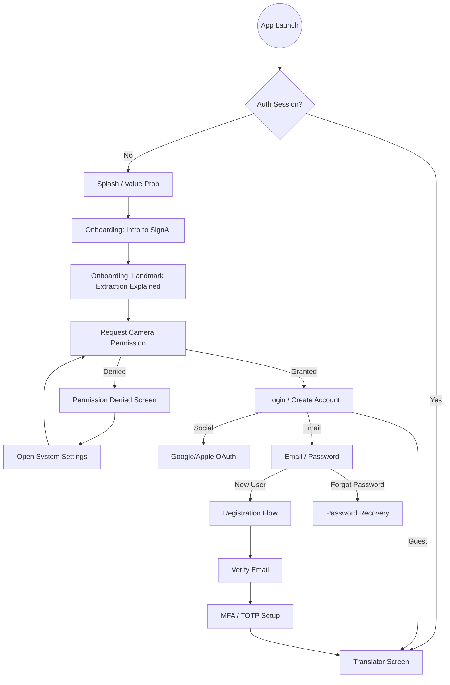
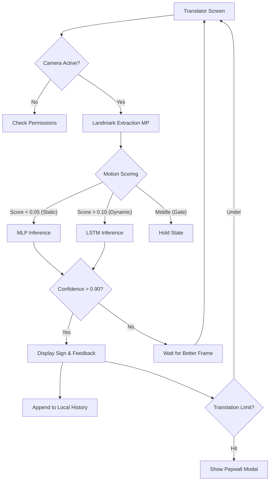
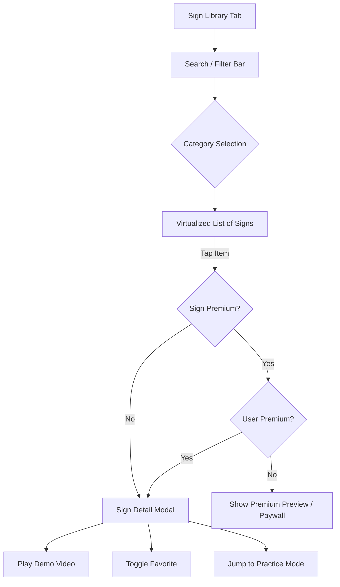
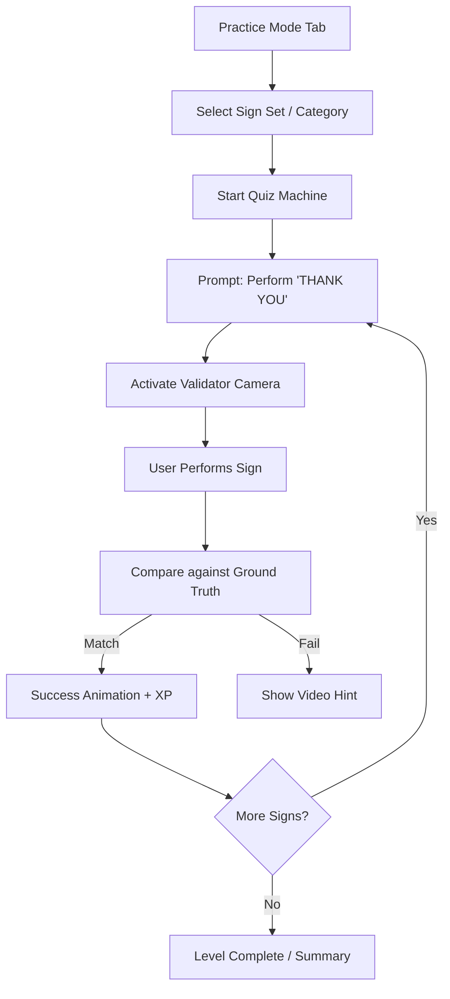
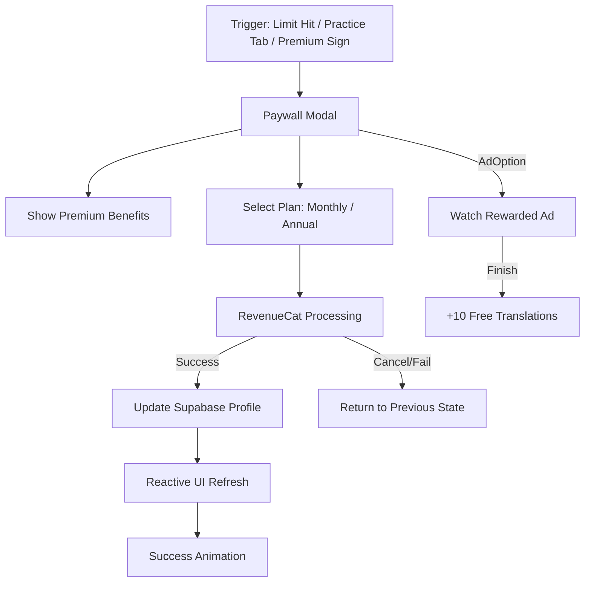

# User Flow Diagrams: SignVision Mobile App

This document provides a comprehensive map of the user experience within the SignVision app, covering core functionality, premium features, and edge-case handling.

---

## 1. Authentication & Onboarding Flow (Level 1)
*Goal: Ensure the user is properly set up and understands the value prop before entering the core loop.*

---

## 2. Core Translation Engine Loop (Level 2)
*Goal: Real-time sign detection with feedback and history.*

---

## 3. Sign Library & Educational Flow (Level 2)
*Goal: Browsing the database and learning new signs.*

---

## 4. Practice Mode Flow (Level 3 - Premium)
*Goal: Gamified learning with AI-driven validation.*

---

## 5. Monetization & Subscription Flow (System Level)
*Goal: Conversion and entitlement management.*

---

## 6. Edge Cases & Error Scenarios
| Scenario | App Reaction |
| :--- | :--- |
| **No Internet** | Show "Offline Mode" banner; use local cached models; disable Supabase sync. |
| **Camera Blocked** | Show full-screen overlay with "How to enable" instructions. |
| **Low Confidence** | Display "Keep hand steady" or "Better lighting needed" tooltips. |
| **Subscription Expired** | Revoke `is_premium` flag on next fetch; sync with RevenueCat beacon. |
| **Account Deletion** | Wipe all `translation_history` and `profiles` records via Supabase RLS delete. |
| **MFA Lost** | Trigger "Recovery Code" flow or "Contact Support" link. |

---

**Note:** All diagrams use **Mermaid** syntax, which can be visualized in VS Code, GitHub, and various design tools.
